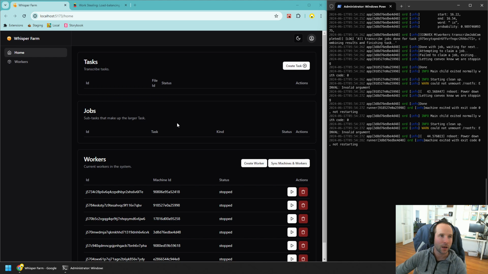

# Whisper Farm

This is a *Proof Of Concept* project to implement a version of [Ian Macartney's excellent Work Stealing strategy](https://stack.convex.dev/work-stealing) for [Whisper](https://openai.com/index/whisper/) based transcription.

This project heavily relies upon ffmpeg, [whisper-standalone-win](https://github.com/Purfview/whisper-standalone-win) and many other excellent technologies, so big thanks to them for doing the hard work.

Demo video and further technical details can be found on my blog post: https://mikecann.co.uk/

## Development

`bun install`

Make a `.env.local` file in the root of the project, checkout `example.env.local` for the kind of env vars you will need.

In one terminal `bun dev:ts` to dev types (I like to do this in a separate terminal as Webstorm provides clickable links to the errors if I do)

In another terminal `bun dev` to start Vite and Convex

## Testing Worker

The worker can either be tested in the docker container with `bun docker:build-and-run` or outside the container with `bun start:worker` to do that you will need to provide whisper on the PATH by downloading a binary from: https://github.com/Purfview/whisper-standalone-win and stick it on you PATH.

## Misc

Use 'dive' to explore a Docker image contents: https://github.com/wagoodman/dive

I was testing this on Windows, no idea if it works on other platforms.

## Issues / Future Work

+ The transcription result might be larger than the 1mb row limit in the database (https://docs.convex.dev/production/state/limits) so we might have to store it as a file instead
+ There is virtually no error handling around fly machines starting up etc, so this is definately required to make sure we can recover from errors
+ There is not much in the way of testing at all at the moment, so this makes me a bit nervous about the fragile code
+ In addition to the above the code is rather messy and really could do with tidying up
+ There is no authorization or authentication in place so this is obviously not great
+ There is no limits on the number of workers that can be started, so this could be a problem
+ The UI is really very basic and could do with a lot of work and is more of an experiment than anything else for me to tinker with Shadcn and Tailwind